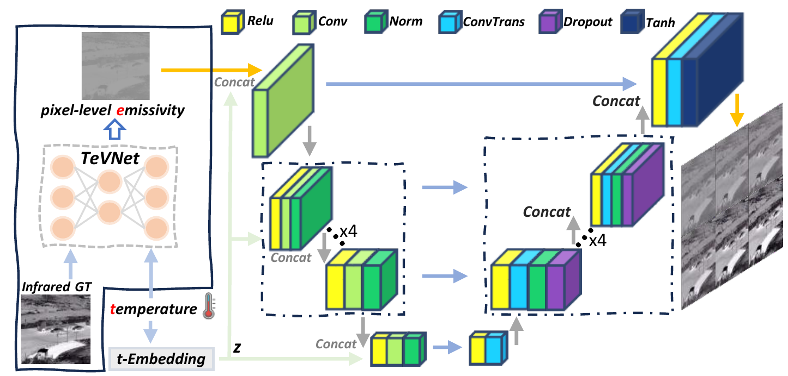
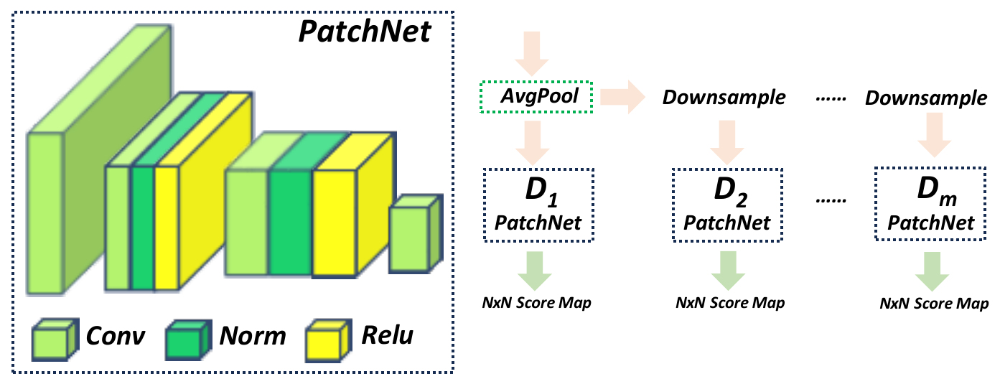

# TempGAN: Physics-Informed Temperature-Controllable GAN for Infrared Image Generation

<p align = "center">Fuchao Wang<sup>a</sup>, Jian Fang<sup>b</sup>, Pengfei Liu<sup>b</sup>, Ronghua Zhang<sup>a</sup>, Yuhuai Peng<sup>a,c,*</sup>, Huaici Zhao<sup>a,b,*</sup>
<p align = "center">a.School of Computer Science and Engineering,  Northeastern University, Shenyang, Liaoning, China</p>
<p align = "center">b.Shenyang Institute of Automation, Chinese Academy of Sciences, Shenyang, Liaoning, China</p>
**Abstract** Existing infrared image generation methods mainly rely on data-driven cross-modal translation while neglecting the physical mechanism of thermal radiation, resulting in limited temperature controllability and poor physical consistency. To address this issue, we propose TempGAN, a physics-guided infrared image generation framework based on thermal radiation decoupling. Specifically, we design a temperature-guided infrared decomposition model that disentangles infrared images into temperature maps, pixel-wise emissivity maps, and a thermal vector matrix. The extracted emissivity maps serve as stable physical priors to characterize scene structure and material properties. Based on this decoupled representation, TempGAN jointly conditions the generation process on emissivity maps and temperature embeddings, enabling controllable infrared image synthesis under different thermal conditions. Furthermore, we introduce a temperature-sensitive constraint and a physical reconstruction constraint to enforce thermodynamic consistency between temperature and infrared radiation intensity. To support training and evaluation, we construct the MCIR multi-condition infrared dataset. Extensive experiments demonstrate that TempGAN outperforms existing methods in image realism, visual quality, and physical plausibility, while effectively preserving the intrinsic temperature–radiation relationship.

<h2>Architecture</h2>

|                       TempGAN Overview                       |                        Discriminator                         |
| :----------------------------------------------------------: | :----------------------------------------------------------: |
|  |  |

<h2>Results</h2>

|  |
| :-------------------------------------------------: |
|   |
|   |

## Datasets


```Plaintext
- TempGAN
  -- datasets
     --- MCIR
         ---- train
         ---- val
         ---- images_info.json  # metadata
```

- The dataset utilized in this study is publicly accessible via the following link: [BaiDuNetdisk](https://pan.baidu.com/s/15hL7sOsA84EmRGT73StKhA?pwd=4y49).
- The raw video data is available at: [BaiduNetdisk](https://pan.baidu.com/s/1UtEhM0lB9HVbzQr2GifH4w?pwd=jeq1). Additionally, the source code required for data processing and preprocessing can be found in our GitHub repository: [GitHub ](https://github.com/wangfc0913/data_processing_toolset.git).

If you have any questions, please contact [Fuchao Wang](wfc117@163.com).

## Temperature-Guided Infrared Decomposition


## Train

```sh
cd TempGAN
python train.py --display_id 1 --dataroot ./datasets/MCIR --name temp_gan --model temp_gan --batch_size 8 --conditional_D
```

